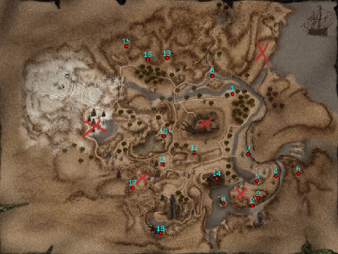
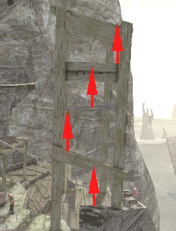
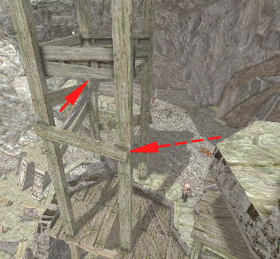
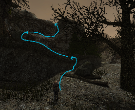
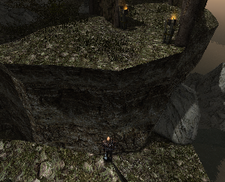

## Mapa Górniczej Doliny {#mapa-gorniczej-doliny}

## Praca w obozie {#praca-w-obozie}
Pierwszym zadaniem, które otrzymujemy od Pyrokara, jest zdobycie doświadczenia poprzez wykonywanie zadań oraz pokonywanie potworów w okolicy, aż do osiągnięcia 5 poziomu. Dopiero po spełnieniu tego warunku Pyrokar zleci nam kolejne zadanie.

## Obrączka Fenii {#obraczka-fenii}
Fenia, gotująca gulasz w pobliżu sklepów Bospera i Mattea, zgubiła swój pierścionek. Można go znaleźć na skalnym zboczu, za ławką, na której siedzi.

## Mięso na Gulasz {#mieso-na-gulasz}
Fenia prosi nas również o dostarczenie tuzina kawałków mięsa do przygotowywanego gulaszu. Najłatwiej zdobyć je, zabijając stado ścierwojadów znajdujące się w pobliżu obozu Aidana. (1 na mapie)

## Orkowi Zwiadowcy {#orkowi-zwiadowcy}
Zadanie zleca Wulfgar, strażnik pełniący wartę na wieży strażniczej. Musimy zabić trzech orków znajdujących się po drugiej stronie zniszczonego mostu. Najłatwiej wykonać to zadanie, używając dwóch Zwojów Małej Burzy Ognistej lub zostawić na później. (2 na mapie)

## Znikające Ryby {#znikajace-ryby}
Rybak Farim prosi nas o ustalenie, dlaczego połowy ryb są tak słabe. W tym celu należy udać się nad jezioro, płynąc w lewo od zniszczonego mostu, a następnie wyeliminować topielce znajdujące się na wysepce. (3 na mapie)

## Siostrzeniec Marnotrawny {#siostrzeniec-marnotrawny}
Thorben prosi nas o odnalezienie zaginionych narzędzi oraz swojego siostrzeńca, Elvricha. Elvricha znajdziemy w pobliżu wieży strażniczej, na której wartę pełni Wulfgar. Obok niego leży piła. Młotek znajduje się obok Regisa, który stoi na szczycie fortecy, naprzeciw wejścia do jaskini. Toporek leży przy drodze pomiędzy handlarzami a strażnikami u podnóża fortecy.

Dodatkowo możemy odnaleźć Elvricha, pobić go, aż wytrzeźwieje, a następnie poinformować Thorbena, że jego siostrzeniec wrócił do pracy.

## Wieża {#wieza}
Miecz Regisa jest wbity w dach drewnianej wieży, obok której stoi sam Regis. Aby się do niego dostać, trzeba wykonać krótki parkour.

**Opcja 1** – wspinaczkę należy rozpocząć z murka, znajdującego się przy wieży. Następnie wskakiwać na kolejne piętra, zgodnie ze wskazaniem strzałek.

**Opcja 2** – Należy wspiąć się na ruiny budynku, a następnie wskoczyć na deskę wskazaną, przez strzałkę przerywaną. Następnie należy zamienić się w chrząszcza i przejść po desce równoległej do drugiej strzałki.  Następnie kontynuujemy wspinaczkę, analogicznie jak w opcji 1 (dwie górne strzałki).

## W Biały Dzień {#w-bialy-dzien}
Na naszych oczach Borka okrada Orlana. Należy natychmiast ruszyć za złodziejem i zaatakować go przy pierwszej nadarzającej się okazji. W przeciwnym razie będzie uciekał w nieskończoność, zatrzymując się jedynie od czasu do czasu, aby powiedzieć nam, żebyśmy dali mu spokój. Po pokonaniu Borki odzyskujemy skradzioną sakiewkę i oddajemy ją Orlanowi.

## Pozłacany Posążek Innosa {#pozlacany-posazek-innosa}
Serpentes zleca nam odnalezienie skradzionego posążka. Najpierw rozmawiamy z patrolującym okolicę Pablem, który informuje nas, że posążek znajduje się u jednego z handlarzy. Następnie udajemy się do Bospera i kupujemy go za 50 sztuk złota.

Po odzyskaniu posążka mamy do wyboru trzy rozwiązania:

* Możemy wydać Bospera Serpentesowi. W nagrodę otrzymamy 400 punktów doświadczenia oraz 100 sztuk złota, jednak Bosper przestanie z nami handlować.

* Możemy zachować jego tajemnicę. W takim przypadku Bosper pozostanie naszym handlarzem, ale nie otrzymamy nagrody pieniężnej od Serpentesa.

* Istnieje również możliwość odkrycia, że pierwotnym złodziejem posążka był Valentino. Aby uzyskać tę informację, należy odpowiednio poprowadzić rozmowę z Bosperem, wybierając kwestię: „Ktoś ukradł ten posążek magom. Możesz mieć kłopoty.”

## Pozdrowienia {#pozdrowienia}
Dostajemy to zadanie tylko jeżeli odkryjemy, że to Valentino ukradł posążek Innosa. Serpentes prosi nas o pobicie złodzieja, nie możemy dać się złapać.

## Rozdrabniacz {#rozdrabniacz}
Po pierwszej rozmowie Kati zwraca się do nas z prośbą o zdobycie Rozdrabniacza, twierdząc, że skoro i tak nie mamy zajęcia, możemy jej pomóc. Przedmiot można kupić u Bospera za 7 sztuk złota. Warto pamiętać, że zadanie należy ukończyć tego samego dnia, dlatego najlepiej przyjąć je, gdy Bosper nadal prowadzi sprzedaż.

## Pomoc Przy Zbiorach {#pomoc-przy-zbiorach}
Aby nie zepsuć zadania, należy zerwać 55 rzep z nieparzystych rajek  (1,3,5,7) i przekazać je Akilowi. Jeżeli zerwiemy choć jedną rzepę z rajek 2,4,6. Zadanie zostanie niezaliczone.

## Kufer Randolpha {#kufer-randolpha}
Randolph zgubił klucz do swojego kufra znajdującego się za polem rzepy. Aby go odzyskać, uczymy się otwierania zamków od Rączki, a następnie przynosimy Randolphowi zawartość kufra (`PLPLPP`).  
Jeśli oddamy mu alkohol, otrzymamy mniejszą ilość doświadczenia oraz 35 sztuk złota. Jeśli odmówimy, nagrodą będzie 700 punktów doświadczenia.

## Owce {#owce}
Balthasar obawia się o swoje owce, ponieważ Alwin ma wobec nich złe zamiary.

**Opcja 1** – Należy pogadać z Alwinem, a następnie go pobić. 

**Opcja 2** – Należy Pogadać z Alwinem, a następnie pójść do jego żony i opowiedzieć im o konflikcie między jej mężem a Balthasarem. Lucy zasugeruje nam, aby przynieść Alwinowi 6 sztuk mięsa innego niż owcze.

**Opcja 3** – Należy pogadać z Alwinem i zapłacić mu 100 sztuk złota.

**Opcja 4** – Należy pogadać z Alwinem, a następnie zdradzić Balthasara, zabijając w nocy jego owce. Ich mięso  należy dostarczyć Alwinowi.

## Przedstawienie {#przedstawienie}
Jimmy da nam 30 sztuk złota jeżeli damy się pobić na arenie. Dajemy się pobić i dostajemy trochę doświadczenia i obiecane złoto.

## Strzelec Wyborowy {#strzelec-wyborowy}
Dorian zakłada się z nami o 30 sztuk złota, że nie trafimy Krwiopijcy znajdującego się na małej skalnej półce pod nim, używając łuku lub kuszy. Jeśli zejdziemy na tę półkę, zakład zostanie unieważniony. W przypadku braku broni dystansowej można go pokonać np. za pomocą Zwoju Kuli Ognia.

## Opał {#opal}
Jeśli wieczorem podejdziemy do ogniska naprzeciw wejścia do jaskini, w której są farmy, Akil poprosi nas o przyniesienie drewna na opał. Najbliższe zasoby znajdują się na płaskowyżu na północ od fortecy, poza jej granicami.

Aby się tam dostać, należy wskoczyć do wody i płynąć z nurtem aż do palisady orków. W miejscu docelowym zbieramy 24 gałęzie. Po drodze, między wilkami a drewnem opałowym, znajduje się również wartościowa broń, przydatna na początku gry. (4 na mapie)

## Myśliwi {#mysliwi}
Pyrokar zleca nam sprawdzenie, co stało się z grupą myśliwych. Zgodnie z jego wskazówkami udajemy się do ich kryjówki w pobliżu jaskini, w której wcześniej przebywały Czarne Gobliny strzegące Almanachu. Na miejscu odkrywamy, że wszyscy myśliwi nie żyją, z ich zwłok zabieramy Miecz którym zabito Goraxa, po czym wracamy z informacjami i ostrzem do Pyrokara. (5 na mapie)

## Ręce do pracy {#rece-do-pracy}
Parlan przekazuje nam Runy Teleportacyjne i zleca, aby dać ją wybranym osobom przebywającym poza fortecą. Runa powinna trafić do osób, które mogą realnie przysłużyć się obozowi.

Do kandydatów należą:

1. **Butch** – nie warto przekazywać mu runy, ponieważ psuje to zadanie.

2. **Pock** – po pokazaniu głowy Blizny, znajduje się w obozie Blizny.

3. **Kyle** – po pokazaniu głowy Blizny, znajduje się w obozie Blizny.

4. **Graham** – po pokazaniu głowy Blizny, znajduje się w obozie Blizny.

5. **Grimes** – znajduje się na przełęczy; można z nim porozmawiać dopiero po otrzymaniu od Pyrokara runy teleportacyjnej na przełęcz.

6. **Draal** – przebywa w więzieniu zamkowym, klucz do drzwi posiada ork pilnujący wejścia.

7. **Gestath** – dostępny po ukończeniu zadania „Polowanie na trolle”, znajduje się przy wejściu do Starej Kopalni.

8. **Dutch** – znajduje się nad obozem orków Var-Ragnara.

Aby zakończyć zadanie, należy sprowadzić łącznie 5 osób.

## Zabójcy Maga Ognia {#zabojcy-maga-ognia}
Pyrokar zleca nam ustalenie, kto odpowiada za śmierć ludzi z obozu myśliwych. W tym celu rozpoczynamy dochodzenie.

Rozmawiamy ze strażnikiem Boltanem, który patroluje okolicę rzeki przy fortecy, ten wspomina o wrzaskach dochodzących zza gór na wschodzie. Udajemy się w tamten rejon: płyniemy strumieniem w dół, a następnie wspinamy się po skałach po prawej stronie. Na górze spotykamy Drake’a, będącego częścią obozu Skorpiona (6 na mapie). Aby nie wzbudzić jego podejrzeń, mówimy mu, że jesteśmy byłym skazańcem. Za jego poleceniem kierujemy się do Skorpiona, który to zleca nam parę zadań.

Po wykonaniu zadania „Mięso za strzały” Skorpion prosi nas o rozmowę w odosobnionym miejscu. W trakcie rozmowy należy powiedzieć prawdę. Skorpion ujawnia, że jego grupa nie stoi za zabójstwem Goraxa – odpowiedzialni są bandyci dowodzeni przez Bliznę.

Następnie następuje seria rozmów:

* Najpierw ponownie rozmawiamy z Pyrokarem,

* Potem wracamy do Skorpiona, który kieruje nas do swoich ludzi,

* Rozmawiamy z Horacym, a następnie z Harlokiem,

* Harlok wysyła nas do Aidana.

Po rozmowie z Aidanem udajemy się do wieży Xardasa. Po drugiej stronie pobliskiego jeziora spotykamy Ratforda i Draxa (18 na mapie). Informują nas oni o obozie bandytów Blizny, znajdującym się na skałach na południe od zamku oraz jak się do niego dostać bez wzbudzania podejrzeń. Potrzebujemy do tego Łachów Skazańca, które można kupić od kowala Stone’a za 200 sztuk złota.

Do obozu dostajemy się, wspinając się po półkach skalnych od strony zamku. W Łachach Skazańca wchodzimy do środka i rozmawiamy z Brucem, a następnie z Lewusem. Wykonujemy zadanie dla Lewusa, a gdy każe nam zebrać 150 bryłek, decydujemy się go nazajutrz pobić, co daje nam możliwość porozmawiania z Blizną.

Naszym ostatecznym celem jest odzyskanie Kamienia Ogniskującego skradzionego przez Bliznę, który jest zamknięty w jednej ze skrzynek gdzie ten przesiaduje. Okazja do pozbycia się Blizny nadarza się gdy ten przychodzi nadzorować proces szukania kosztowności w kraterze wulkanu podczas zadania „Skarb”. Po jego zabiciu wracamy do obozu bandytów, pokazując głowę Blizny Roscoe i przeszukujemy skrzynie na półce skalnej.

Z odzyskanym Kamieniem Ogniskującym wracamy do Pyrokara, kończąc zadanie.

## Zębacze {#zebacze}
Skorpion zleca nam zabicie okolicznych zębaczy, bierzemy Drake’a (dajemy mu miksturę leczniczą) oraz Orre’go. Zabijamy potwory i wracamy do Skorpiona.

## Piła {#pila}
Horacy potrzebuje nowej piły, kupujemy albo znajdujemy jakąś leżącą na ziemi.

## Ziele {#ziele}
Kagan chce skręta bagiennego ziela, znajdujemy je np. w obozie bandytów Blizny (przykładowo po pobiciu Siry), lub przy ciele Isidro.

## Isidro {#isidro}
Kagan zleca nam znalezienie i nakłonienie do powrotu do obozu Isidro. Udał się w stronę dawnego obozu na bagnie. Znajdujemy jego martwe ciało jeżeli pójdziemy wzdłuż palisady (7 na mapie). Znaleziony przy trupie pierścień możemy oddać Kaganowi, ten da nam pancerz, który jest odpowiednikiem Stroju z Czerwonej Tkaniny.

## Głód {#glod}
Guy jest głodny i chce zupę rybną, możemy ją znaleźć albo kupić np. od Orlana.

## Chłód {#chlod}
Możemy oddać Guy’owi skórzany pancerz, w zamian za to otrzymamy „Naramiennik”. Możemy go połączyć z szatą, którą dostajemy od Kagana za znalezienie Isidro.

## Mięso za Strzały {#mieso-za-strzaly}
Skorpion zleca nam odebranie dostawy mięsa od Aidana (8 na mapie). W tym celu najpierw zabieramy strzały od Santino – wystarczy go zmusić, aby oddał je bez walki.

Następnie udajemy się do Aidana, który przebywa pod ścieżką prowadzącą na plac wymian, w pobliżu rzeki. Podczas rozmowy okazuje się, że posiada on jedynie 20 sztuk mięsa.

Możliwe są trzy rozwiązania:

* Przekazujemy Aidanowi strzały i dokładamy 10 sztuk mięsa z własnych zasobów,

* Samodzielnie polujemy i oddajemy 30 sztuk mięsa, zachowując 100 strzał,

* Oddajemy tylko 20 sztuk mięsa, co skutkuje niezadowoleniem Skorpiona.

## Ptaszysko {#ptaszysko}
Harpie ukradły kuszę należącą do Rugi. Aby mu pomóc, musimy przejść na drugą stronę rzeki, a następnie zabić harpie gnieżdżące się na szczycie jednego z kamiennych wzniesień (9 na mapie). Naszym głównym celem jest Wielka Harpia – po jej zgładzeniu odzyskujemy broń i wracamy do Rugi, aby odebrać nagrodę.

## Bracia {#bracia}
Pod wieżą Xardasa spotykamy Draka – dawnego strażnika świątynnego. Możemy połączyć z nim siły i wspólnie wkroczyć do wieży, by rozprawić się z rezydującymi tam poszukiwaczami oraz kilkoma szkieletami.

## Praca jako kopacz {#praca-jako-kopacz}
Pracujemy dla Lewusa. Po tym, jak po raz pierwszy oddamy mu bryłki, ten zażąda od nas kolejnych, tym razem 150 sztuk. Nazajutrz decydujemy się go pobić gdyż nie jesteśmy w stanie zdobyć takiej ilości. Po pokonaniu Lewusa idziemy porozmawiać z Blizną. Podczas rozmowy z Blizną nie wolno zadać pytania: „Co będę z tego miał?”, ponieważ po jego usłyszeniu ten nas pobije.

## Paczka {#paczka}
Blizna wysyła nas na bagna, abyśmy odebrali paczkę od Świstaka i Złego. Obaj znajdują się niedaleko chaty Cavalorna. Aby do nich dotrzeć, zamiast iść do samej chaty, skręcamy w lewo pod mostem (mając zniszczoną wieżę po prawej stronie), a następnie ponownie skręcamy w lewo (10 na mapie).

Aby w ogóle chcieli z nami rozmawiać, musimy odpowiedzieć na pytanie Złego; prawidłowa odpowiedź to „Roscoe”. Z kolei aby otrzymać od nich paczkę, musimy ich pobić albo wspólnie z nimi oczyścić bagna.

## Uratować niewiastę {#uratowac-niewiaste}
Graham twierdzi, że Kosa więzi Sirę w swojej chacie na szczycie górki. Udajemy się tam i ją „uwalniamy”. Na miejscu okazuje się jednak, że Sirze wcale nie przeszkadzała sytuacja, w której się znajduje i każe nam się wynosić. Wracamy do Grahama, aby przekazać mu to, co usłyszeliśmy.

## Gwoździe {#gwozdzie}
Homer prosi nas o odzyskanie Torby z Gwoźdźmi, która znajduje się na południu od obozu bandytów, przy zniszczonej wieży (11 na mapie). Aby wyminąć kręcących się tam orków, możemy użyć mikstury szybkości. Po zdobyciu torby wracamy do Homera po nagrodę.

## Nocna zmiana {#nocna-zmiana}
Kyle chciałby się zamienić zmianą z innym kopaczem, Gravo mówi nam że Glen może by się zmienił ale trzeba mu przynieść 3 sztuki rośliny, której zapomniał nazwy. Tą rośliną jest Zębate Ziele, ale należy przynieść mu 5 sztuk, po oddaniu mu roślin ten zgadza się na zamianę z Kylem.

## Złodziej jagód {#zlodziej-jagod}
Ryżowy Książe ma problem ze złodziejem podkradającym mu jagody z ogródka, czekamy na noc i chowamy się w okolicy kotła. Między 2:00 a 3:00 przychodzi złodziej, którego konfrontujemy.

## Szrama {#szrama}
Velaya, siedząca na mostku od 8 do 12 chce żebyśmy pobili Serafię. Musimy to zrobić w nocy gdy ta pali zioło na skałkach w obozie niedaleko chaty Kosy. Po jej pobiciu wracamy po nagrodę do Velayi.

## Maczeta Bruce’a {#maczeta-brucea}
Bruce prosi nas o odzyskanie jego maczety, którą ukradł pobliski ork po tym, jak spadła z klifu. W tym celu eliminujemy grupę trzech orków stojących przy wejściu do obozu, zaraz obok ściany klifu (12 na mapie).

## W obronie słabszego {#w-obronie-slabszego}
Aby otrzymać to zadanie, należy wcześniej okraść Jeremiasza gdy stoi obok, np. zabierając menzurki z półki w trakcie jego pracy przy produkcji alkoholu. Po tym zdarzeniu Jeremiasz informuje nas, że Krzykacz bezczelnie kradnie jego alkohol a my możemy mu w tym pomóc.

Następnie udajemy się do Krzykacza i „rozmawiamy” z nim w tej sprawie.

## Zdrajcy {#zdrajcy}
Po wykonaniu zadania „Paczka” Blizna zleca nam zajęcie się grupą zdrajców, którzy udali się w stronę przełęczy. Ich obóz znajduje się w pobliżu zasypanej drogi prowadzącej do Kanionu Trolli (13 na mapie), obok obozu spotykamy Kosę, który również został wysłany aby zająć się zdrajcami. 

Zadanie można rozwiązać na dwa sposoby:

* Po rozmowie z Kosą możemy od razu zaatakować obóz i odzyskać skradzione kosztowności,

* Możemy porozmawiać z Aaronem, który proponuje zabicie Kosy w zamian za kosztowności. Jest to jednak podstęp – grupa zbiegów zaatakuje nas, gdy tylko poinformujemy Aarona o śmierci Kosy.

Po wyeliminowaniu grupy Aarona wracamy do Blizny po nagrodę.

## Skarb {#skarb}
Blizna zleca nam również o odnalezienie skarbu w kraterze ognistego smoka. Mamy odszukać grupę wysłaną w kierunku pobliskiego wulkanu. Podążamy ścieżką prowadzącą na wulkan, gdzie po drodze spotykamy Pachę i wspólnie przebijamy się do krateru (14 na mapie).

Na miejscu okazuje się, że skarbu nie ma, jednak pojawia się Blizna, co daje nam okazję do odzyskania Kamienia Ogniskującego. 

Jednak najpierw idziemy pokazać głowę Blizny mieszkańcom obozu bandytów. Po okazaniu jej Roscoe możemy swobodnie przeszukać obóz i zebrać wszystkie przedmioty, w tym Kamień Ogniskujący ze skrzyni.

## Siostrzenica marnotrawna {#siostrzenica-marnotrawna}
Gritta, siostrzenica Thorbena, zaginęła. W pierwszej kolejności należy wypytać handlarzy na targowisku, jednak nie dostarczają oni żadnych informacji. Dopiero rozmowa z Rugą, patrolującym brzeg rzeki, pozwala ustalić, że Gritta wskoczyła do wody i popłynęła z nurtem rzeki.

Odnajdujemy ją w obozie Skorpiona, skąd nie chce wracać z powrotem do swojego wuja. Wracamy więc do Thorbena, aby przekazać mu te informacje. Jeżeli wrócimy do obozu Skorpiona Gritta sama nas zaczepia – okazuje się, że mieszkańcy obozu źle ją traktują i chce wrócić do domu. Możemy jej pomóc, np. przekazując runę teleportacyjną do fortecy.

## Deszcz Ognia {#deszcz-ognia}
Hyglas prosi nas o dostarczenie składników potrzebnych do przygotowania zwoju „Deszcz Ognia”. Są to:

* 2 języki ognistego jaszczura – jeden można znaleźć np. na skale, na jeziorze obok zalanej wieży Xardasa, a drugi w orkowym namiocie, obok wbitego w mur tarana. Alternatywnie np. Gestath może nas nauczyć zdobywania ich z Ognistych Jaszczurów.

* Słoik smoły – można kupić u Bospera.

* 2 kawałki siarki – można kupić u Bospera.

## Utylitaryzm {#utylitaryzm}
Balam z obozu Skorpiona zleca nam zabicie rybaka z Górskiej Fortecy. W nocy zabijamy śpiącego Farima i idziemy do Balama przekazać wieści.

## Orkowe Mapy {#orkowe-mapy}
Pyrokar zleca nam zdobycie 5 map orkowych przywódców, szczegółowe informacje dostajemy od Cavalorna co do lokalizacji każdej z map. Poniżej porady jak zdobyć każdą z nich:

**Ygh-Trok** – wraz z łowcami orków stacjonującymi w niewielkim obozie na klifie, obok wejścia do obozu orków, możemy zaatakować wrogą grupę. W trakcie wyprawy bez większych trudności zdobywamy mapę ze skrzyni znajdującej się w skrytce, którą otwieramy kluczem Ygh-Troka.

**Ur-Shak** – do tego obozu dostajemy się przepływając jeziorem pod barykadą. Następnie możemy powoli zabijać orki w okolicy. Kufer z mapą znajduje się w namiocie najbliżej ścieżki prowadzącej w górę. Kod do kufra: `LPLLPPLLPL`.

**Bash-Tak** – aby dostać się do dawnego miasta orków należy wskoczyć po skałach tak jak na obrazku poniżej:

Następnie możemy skałami przejść dookoła głównego obozu orków i na małej półce skalnej otoczonej barykadą znajduje się skrzynka z mapą, do której kod to: `PPPPLLLPLL`.

**Var-Ragnar** – do środka dostajemy się tak jak opisał nam Cavalorn, deskami ułożonymi na palisadzie, owe deski znajdują się blisko obozowiska Aidana. Aby dostać klucz do Var-Ragnara musimy przejść przez „pole błyskawic,” możemy zabić orkowych szamanów bronią  dystansową, magią lub podjeść do błyskawic tak blisko jak możemy i przeskoczyć/przebiec na drugą stronę otrzymując trochę obrażeń. Aby przedostać się na drugą stronę przepaści, należy użyć zwoju przemiany w Cieniostwora i skoczyć. Poniżej zrzut ekranu skąd skaczemy:

**Ukr-Gashtak** – do zamku dostajemy się przy użyciu zwoju przemiany w chrząszcza aby przejść pod bramą. 

Aby bezpiecznie dostać się do wieży musimy wpierw dostać się na dachy zamku, aby to zrobić idziemy na mur obok kuźni i wskakujemy na dach, następnie idziemy aż na dach głównego budynku i stamtąd ostrożnie zeskakujemy na belkę do pokoju najbliższego wejściu do wieży. Drzwi do wieży należy otworzyć wytrychem, kod to: `PLPPLPLPPPPP`. Następnie wspinamy się na szczyt i otwieramy skrzynię z mapą, kod to: `PLPLPPLPLL`.

W dawnych kwaterach paladynów znajdujemy „Klucz do drugich drzwi”, dzięki niemu możemy dostać się do sypialni Gomeza. Ukr-Gashtak znajduje się w głównej sali, w której niegdyś był Gomez, możemy go zabić aby zdobyć jego klucz, otwieramy nim drzwi na 1 piętrze głównego budynku.

Po oddaniu map Pyrokarowi dostajemy runę teleportacji na Przełęcz.

## Polowanie na trolle {#polowanie-na-trolle}
Przy wejściu do zawalonej starej kopalni spotykamy Gestatha, wraz z nim polujemy na trzy okoliczne trolle(15 na mapie). Aby się do niego dostać należy wspinać się po okolicznych skałach.

## Humanoidalne gady {#humanoidalne-gady}
Przy zawalonym przejściu na przełęcz spotykamy Ratforda, Draxa i Aidana, ci mówią nam, że w lesie zobaczyli Jaszczuroczłeków niosących czerwone jaja. Wraz z grupą idziemy w stronę lasu aby zbadać sytuację. Trzymamy się ściany i znajdujemy małą jamę (16 na mapie), w której walczymy z Jaszczuroczłekami oraz młodymi Smokami. Zabieramy Jajo Smoka, z którym możemy pójść do Maga Neorasa w twierdzy aby rozpocząć kolejne zadanie.

## Mikstura ze smoczych jaj {#mikstura-ze-smoczych-jaj}
Zadanie jest dostępne dopiero po ukończeniu zadania „Humanoidalne gady” oraz jeżeli nie okradliśmy Magów Ognia. Aby je rozpocząć należy porozmawiać z Neorasem, ten zrobi dla nas miksturę ale musimy przynieść mu jeszcze dodatkowo 3 sztuki Szczawiu Królewskiego.

## Czarna perła {#czarna-perla}
Karras może stworzyć dla nas kolejny zwój „Śmiertelnej Fali”, pod warunkiem że dostarczymy mu Czarną Perłę. Można ją znaleźć w krypcie, w której wcześniej znajdował się Kamień Ogniskujący.

Zadanie odblokowuje się dopiero po zużyciu wcześniej otrzymanego zwoju „Śmiertelnej Fali”.

## Magiczny oręż {#magiczny-orez}
Za obozem Bash-Taka, przy ożywieńcu, możemy odnaleźć Magiczny miecz (17 na mapie). Po rozmowie z Pyrokarem dowiadujemy się, że można go naładować przy użyciu runy zawierającej zaklęcie ofensywne oraz 10 bryłek rudy.

Runy można zdobywać podczas wykonywania zadań związanych z orkowymi mapami – przykładowo runę Błyskawicy znajdujemy za polem błyskawic, podczas zdobywania klucza Var-Ragnara.

Rudę natomiast można znaleźć w jaskini obok chaty Cavalorna. Klucz do niej znajduje się na ciele paladyna leżącego na górce obok dawnego obozowiska Aidana.
